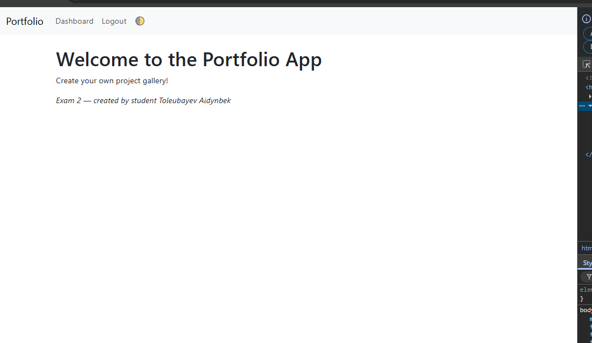
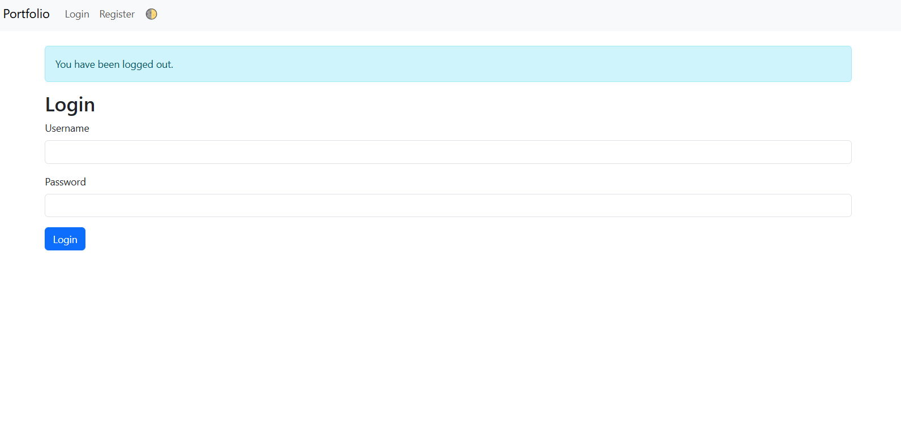
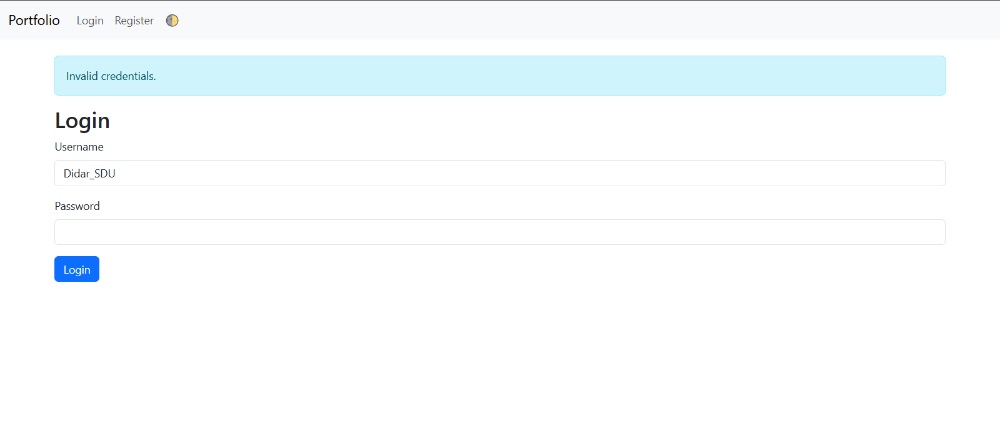
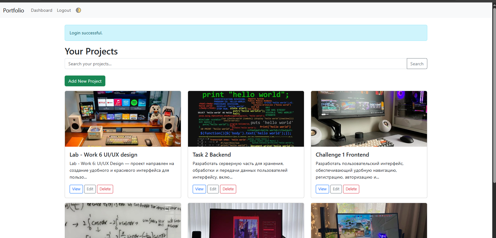
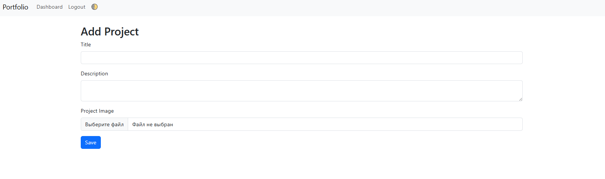
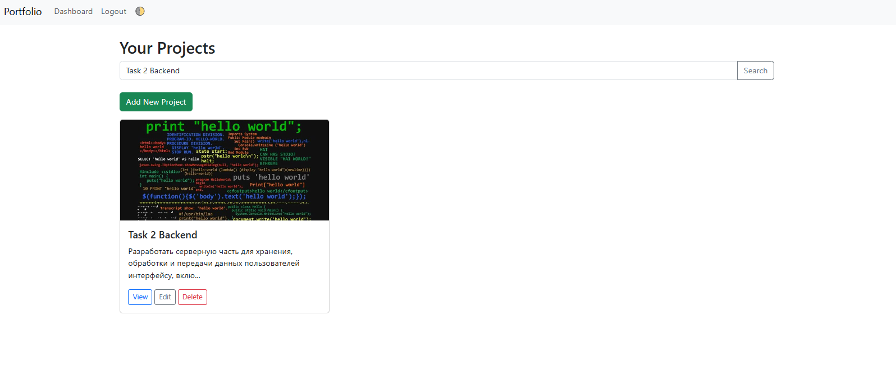
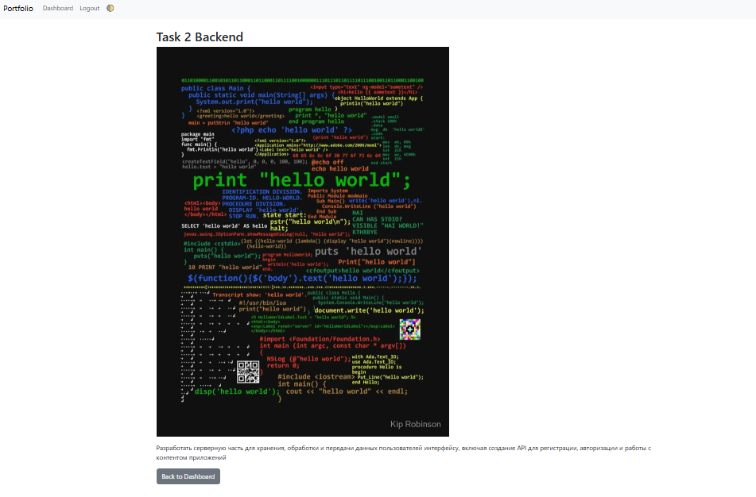
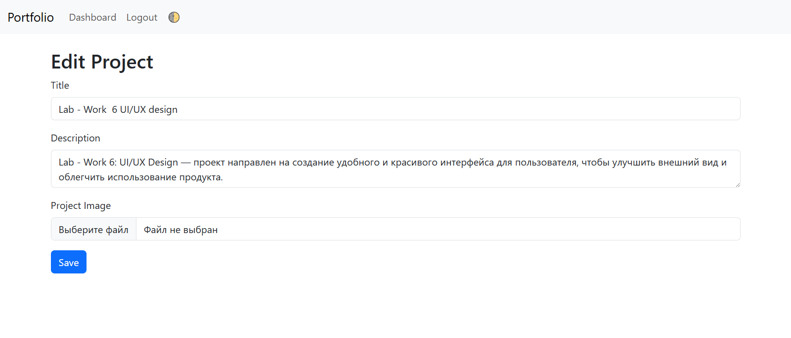
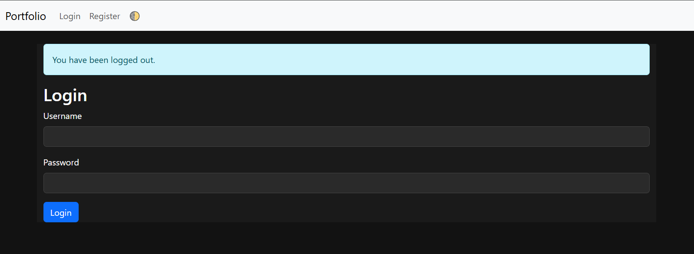

# 📁 Portfolio App — Flask Web Application

A full-featured Flask-based web application that allows users to register, log in, and manage a gallery of personal projects with images, categories, dark mode, and search functionality.

## 🚀 Features

- 🔐 User registration and login
- 📂 Full CRUD for projects (add/edit/delete)
- 🖼 Image uploads with validation
- 🗂 Category selection and filtering
- 🔍 Search by title or description
- 🌗 Light/Dark mode toggle with persistence
- 💾 SQLite database support
- 🧠 Password hashing for security
- 📦 Modular structure with Flask Blueprints
- 🎨 Responsive Bootstrap UI

---

## 📷 Screenshots










> Add your app screenshots here if available.

---

## 🧑‍💻 Local Installation

```bash
git clone https://github.com/yourusername/portfolio-app.git
cd portfolio-app
python -m venv venv
venv\\Scripts\\activate  # or source venv/bin/activate on Mac/Linux
pip install -r requirements.txt
python main.py
